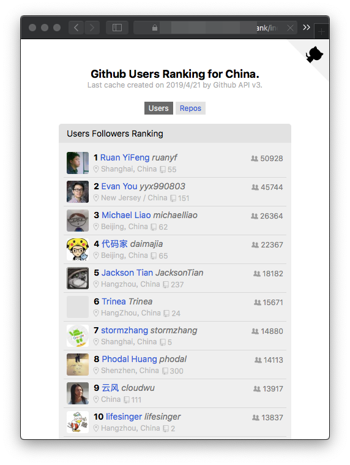

排行榜预览：[Github 预览](http://jaywcjlove.github.io/github-rank/) | [UNPKG预览](https://unpkg.com/@wcj/github-rank/web/index.html) | [Gitee预览](http://jaywcjlove.gitee.io/github-rank)

Github Ranking
---

[](https://www.npmjs.com/package/@wcj/github-rank)

Github中国用户排名，全球仓库 Star 最多排名，通过 Github API v3 来生成页面数据，[排行榜预览](http://jaywcjlove.github.io/github-rank/)。

- [Github **全球** 用户 Followers 排名预览](http://jaywcjlove.github.io/github-rank/)
- [Github **中国** 用户 Followers 排名预览](http://jaywcjlove.github.io/github-rank/users.china.html)
- [Github 全球仓库 Star 最多排名预览](http://jaywcjlove.github.io/github-rank/repos.html)
- [Github 社区趋势榜日、周、月预览](http://jaywcjlove.github.io/github-rank/trending.html) [**`日`**](http://jaywcjlove.github.io/github-rank/trending.html) [**`周`**](http://jaywcjlove.github.io/github-rank/trending-weekly.html) [**`月`**](http://jaywcjlove.github.io/github-rank/trending-monthly.html)
- [SegmentFault 思否 - 近期热门](http://jaywcjlove.github.io/github-rank/sifou-daily.html) [**`日`**](http://jaywcjlove.github.io/github-rank/sifou-daily.html) [**`周`**](http://jaywcjlove.github.io/github-rank/sifou-weekly.html) [**`月`**](http://jaywcjlove.github.io/github-rank/sifou-monthly.html)

[](http://jaywcjlove.github.io/github-rank/)

## 使用

从 `2019年04月20日` 尽量每天在 [`npm`](https://www.npmjs.com/package/@wcj/github-rank) 上发版，版本号以 `年`、`月`、`日` 来定义，如: `v19.4.20`。

```bash
npm install @wcj/github-rank --save-dev
```

使用可以通过引入数据，来获取排名数据，也可以通过 [UNPKG](https://unpkg.com/@wcj/github-rank/dist/users.json) 直接访问[用户排行榜](https://unpkg.com/@wcj/github-rank/web/index.html)。

```js
import users from '@wcj/github-rank';
import repos from '@wcj/github-rank/dist/repos.json';
import trendingDaily from '@wcj/github-rank/dist/trending-daily.json';
import trendingWeekly from '@wcj/github-rank/dist/trending-weekly.json';
import trendingMonthly from '@wcj/github-rank/dist/trending-monthly.json';
```

```js
import users from '@wcj/github-rank';

// 默认 users 输出如下数据：
[
  {
    "login": "jaywcjlove",
    "id": 1680273,
    "node_id": "MDQ6VXNlcjE2ODAyNzM=",
    "avatar_url": "https://avatars1.githubusercontent.com/u/1680273?v=4",
    "gravatar_id": "",
    "url": "https://api.github.com/users/jaywcjlove",
    "html_url": "https://github.com/jaywcjlove",
    "followers_url": "https://api.github.com/users/jaywcjlove/followers",
    "following_url": "https://api.github.com/users/jaywcjlove/following{/other_user}",
    "gists_url": "https://api.github.com/users/jaywcjlove/gists{/gist_id}",
    "starred_url": "https://api.github.com/users/jaywcjlove/starred{/owner}{/repo}",
    "subscriptions_url": "https://api.github.com/users/jaywcjlove/subscriptions",
    "organizations_url": "https://api.github.com/users/jaywcjlove/orgs",
    "repos_url": "https://api.github.com/users/jaywcjlove/repos",
    "events_url": "https://api.github.com/users/jaywcjlove/events{/privacy}",
    "received_events_url": "https://api.github.com/users/jaywcjlove/received_events",
    "type": "User",
    "site_admin": false,
    "score": 1,
    "rank": 117,
    "name": "小弟调调™",
    "company": "ʕ•̫͡•ʔ-̫͡-ʕ•͓͡•ʔ-̫͡-ʔ",
    "blog": "http://wangchujiang.com",
    "location": "Shanghai, China",
    "email": "wowohoo@qq.com",
    "hireable": true,
    "bio": "(͡·̮̃·̃) 撸码的乐趣 💯 ，“人没了，™代码还在”",
    "public_repos": 78,
    "public_gists": 1,
    "followers": 2519,
    "following": 91,
    "created_at": "2012-04-26T00:30:25Z",
    "updated_at": "2019-04-12T14:27:54Z"
  }
]
```